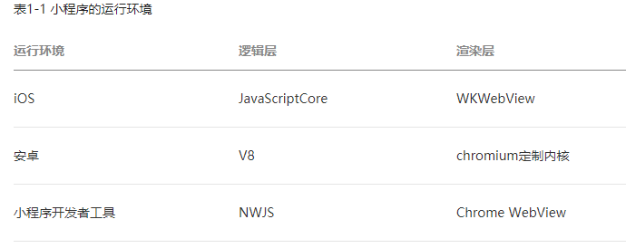

# 第一章 | 微信小程序介绍与开发准备

## ★总结

## ★Q&A

### ①WebView是啥？

> WebView是用于**展示网络请求后的结果**。
>
> 举个例子：你自己写了个APP,你想要用它访问网络，这里假设你要访问百度首页，你不想用手机的自带浏览器，而是想要用你自己的app在内部展示百度网页，那么就可以用webView啦
>
> 说白了：**WebView就是将url网络请求的结果展示在里面**

总之，**WebView**是手机中内置了一款高性能webkit 内核浏览器，然后在SDK 中封装的一个**组件**。 它没有提供地址栏和导航栏，**WebView**只是单纯的展示一个网页界面。

> 数据变化了，那么渲染层就会更新！注意单向数据流！

**➹：**[谈谈 WebView 的使用 - Android - 掘金](https://juejin.im/entry/573441971ea4930060c97cd2)

**➹：**[webview与手机浏览器是什么关系？ - 知乎](https://www.zhihu.com/question/40871670)

**➹：**[WebView是什么东西？ - 知乎](https://www.zhihu.com/question/61823218)

**➹：**[安卓系统webview 是什么来的_百度知道](https://zhidao.baidu.com/question/1052226348657653739.html)