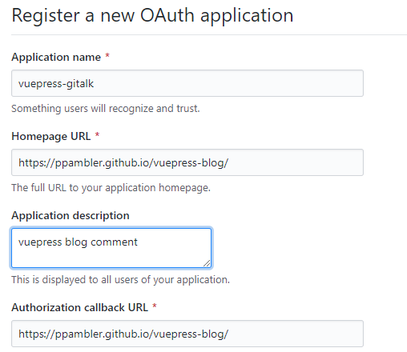

# VuePress 进阶

## ★添加评论功能

### ◇Gitalk 

**①安装Gitalk**

```bash
yarn add gitalk
# or npm i --save gitalk
```

**②Register a new [OAuth](https://github.com/settings/applications/new) application**



**③有两种姿势添加评论**

1. 全局添加评论，即评论功能是共用的。做法是在 创建一个文件 `.vuepress/enhanceApp.js`，并添加以下内容：

```js
function integrateGitalk(router) {
  const linkGitalk = document.createElement('link');
  linkGitalk.href = 'https://cdn.jsdelivr.net/npm/gitalk@1/dist/gitalk.css';
  linkGitalk.rel = 'stylesheet';
  document.body.appendChild(linkGitalk);
  const scriptGitalk = document.createElement('script');
  scriptGitalk.src = 'https://cdn.jsdelivr.net/npm/gitalk@1/dist/gitalk.min.js';
  document.body.appendChild(scriptGitalk);

  router.afterEach((to) => {
    if (scriptGitalk.onload) {
      loadGitalk(to);
    } else {
      scriptGitalk.onload = () => {
        loadGitalk(to);
      }
    }
  });

  function loadGitalk(to) {
    let commentsContainer = document.getElementById('gitalk-container');
    if (!commentsContainer) {
      commentsContainer = document.createElement('div');
      commentsContainer.id = 'gitalk-container';
      commentsContainer.classList.add('content');
    }
    const $page = document.querySelector('.page');
    if ($page) {
      $page.appendChild(commentsContainer);
      if (typeof Gitalk !== 'undefined' && Gitalk instanceof Function) {
        renderGitalk(to.fullPath);
      }
    }
  }
  function renderGitalk(fullPath) {
    const gitalk = new Gitalk({
      clientID: '960……',
      clientSecret: '32f……', // come from github development
      repo: 'vuepress-blog',
      owner: 'ppambler',
      admin: ['ppambler'],
      id: 'comment',
      distractionFreeMode: false,
      language: 'zh-CN',
    });
    gitalk.render('gitalk-container');
  }
}

export default ({ Vue, options, router }) => {
  try {
    document && integrateGitalk(router)
  } catch (e) {
    console.error(e.message)
  }
}
```

2. 局部添加，每个markdown笔记自行决定是否添加评论，如果添加，那就在笔记的末尾添加 `<Comment/>`。做法是创建一个vue组件 `.vuepress/components/Comment.vue`，然后添加一下内容即可！（注意：vuepress会自动注册这个组件，无需自己主动注册该组件！总之组件写好了，就可以直接在markdown笔记里使用了！）

```vue
<template>
  <div id="gitalk-container" class="comment"></div>
</template>
<script>
import 'gitalk/dist/gitalk.css'
import Gitalk from 'gitalk'
import md5 from '../helper/md5.js'

  export default {
    name: '',
    data() {
      return {
        gitalk: new Gitalk({
          clientID: '960……',
          clientSecret: '32f……',
          repo: 'vuepress-blog',
          owner: 'ppambler',
          admin: ['ppambler'],
          id: md5(window.location.pathname),
          distractionFreeMode: false,
          language: 'zh-CN',
        })
      }
    },
    mounted(){
      console.log(this.gitalk.id)
      this.gitalk.render("gitalk-container");
    }

  }
</script>
<style>
.comment {
  padding: 1rem;
}
</style>
```


## ★添加标签功能


## ★总结


## ★Q&A

### ①`npm install -D xxx` 的  `-D` 为何意？

话说，这是 `--save-dev`的缩写吗？或者说这是它的别名吗？

解决姿势：

1. `npm install --help`：查看install命令需要那些参数，结果没有找到我想要的结果

```bash
npm install (with no args, in package dir)
npm install [<@scope>/]<pkg>
npm install [<@scope>/]<pkg>@<tag>
npm install [<@scope>/]<pkg>@<version>
npm install [<@scope>/]<pkg>@<version range>
npm install <folder>
npm install <tarball file>
npm install <tarball url>
npm install <git:// url>
npm install <github username>/<github project>

aliases: i, isntall, add
common options: [--save-prod|--save-dev|--save-optional] [--save-exact] [--no-save]
```

而[官网](https://docs.npmjs.com/cli/install)就给了答案：

```bash
npm install (with no args, in package dir)
npm install [<@scope>/]<name>
npm install [<@scope>/]<name>@<tag>
npm install [<@scope>/]<name>@<version>
npm install [<@scope>/]<name>@<version range>
npm install <git-host>:<git-user>/<repo-name>
npm install <git repo url>
npm install <tarball file>
npm install <tarball url>
npm install <folder>

aliases: npm i, npm add
common options: [-P|--save-prod|-D|--save-dev|-O|--save-optional] [-E|--save-exact] [-B|--save-bundle] [--no-save] [--dry-run]
```

可见 `-D` 是  `--save-dev`的缩写！

其它缩写：

1. `install`：`i`
2. `--global`：`-g`
3. `--save`：`-S`，项目发布之后还依赖的东西
4. `--save-dev`：`-D`，项目开发时候依赖的东西

**➹：** [NPM小结 - 程序猿小卡 - 博客园](https://www.cnblogs.com/chyingp/p/npm.html)

**➹：**[npm-install | npm Documentation](https://docs.npmjs.com/cli/install)

**➹：**[npm install 命令参数的一些简写方式 | 清风轩](https://xovel.cn/article/npm-alias.html)

### ②话说，在npm里边发布的包 可以使用 yarn 直接安装吗？

比如说官网给出的gitalk咩有指明可以使用yarn安装……

我之前只在npm上发布了一个包：

**➹：**[warm-ui-test-1 - npm](https://www.npmjs.com/package/warm-ui-test-1)

然而在yarn上也可以找到这个包：

**➹：**[warm-ui-test-1 | Yarn](https://yarnpkg.com/zh-Hans/package/warm-ui-test-1)

按照官网的解释：

> 为了通过 Yarn 共享你的包给全世界的其他开发者，你需要先发布它。
>
> 通过 Yarn 发布的包会托管在 [npm registry](https://www.npmjs.com/) 上，用于全球分发。

可见这包都在 npm 里边托管，而这些包的下载有两种姿势：

1. npm
2. yarn

::: warning
如果你安装 vuepress 时，是用的 yarn ，那么之后需要安装其它包的操作，最好也是用 yarn 来搞，不然会发生不可预知的错误！或许这是因为 Yarn 有它自己的一套解析算法 来组织`node_modules` 目录，而 npm 也有一套自己的解析算法！

:::

**➹：** [javascript - npm发布和yarn发布能混用吗？ - SegmentFault 思否](https://segmentfault.com/q/1010000019022061)

**➹：** [yarnpkg - What is the equivalent of "npm install --save" in Yarn? - Stack Overflow](https://stackoverflow.com/questions/40134390/what-is-the-equivalent-of-npm-install-save-in-yarn)

**➹：**[Yarn安装与使用详细介绍 | Never_yu's Blog](https://neveryu.github.io/2018/07/20/yarn/)

**➹：** [从 npm 迁移 | Yarn](https://yarnpkg.com/lang/zh-hans/docs/migrating-from-npm/)

### ③OAuth是啥？

[OAuth 2.0](http://www.ruanyifeng.com/blog/2014/05/oauth_2_0.html) 是目前最流行的授权机制，用来授权第三方应用，获取用户数据。

如xxx用户想要评论博客，那么xxx用户（第三方应用）得授权通过才行。

**➹：**[OAuth 2.0 的一个简单解释 - 阮一峰的网络日志](http://www.ruanyifeng.com/blog/2019/04/oauth_design.html)

### ④Vue组件使用？

所有在 `.vuepress/components` 中找到的 `*.vue` 文件将会**自动地被注册为全局的异步组件**，如：

```text
.
└─ .vuepress
   └─ components
      ├─ demo-1.vue
      ├─ OtherComponent.vue
      └─ Foo
         └─ Bar.vue
```

你可以**直接使用这些组件在任意的 Markdown 文件**中（**组件名是通过文件名取到的**）：

```md
<demo-1/>
<OtherComponent/>
<Foo-Bar/>
```

注意，自定义组件的名字包含连接符或者是 PascalCase。不然，就会导致 HTML 渲染紊乱，因为你不准守这样的约定的话，那么该组件将被当作是内联元素，然后被包裹在一个 `p`标签中，而HTML 标准规定， `<p>`标签中不允许放置任何块级元素。

> 其实这样 `comment.vue`也是ok的！不过最好还是按照 vuepress 的约定来！

**➹：** [在 Markdown 中 使用 Vue | VuePress 1.x](https://v1.vuepress.vuejs.org/zh/guide/using-vue.html#%E4%BD%BF%E7%94%A8%E7%BB%84%E4%BB%B6)

### ⑤Gitalk能自动为 issues 生成 labels 吗？


### ⑥如何引入md5？

我之所以要引入md5是因为需要把gitalk的id选项给md5化了。

做法如下：

1. `yarn add blueimp-md5`
2. 在`Comment.vue`组件里边引入它：`import md5 from 'blueimp-md5'`，这得到的是一个md5函数
3. 可以data里边直接 `id: md5(window.location.pathname)`

遇到的坑，主要是对md5的引入 ：

我之前直接把这个[url](https://cdn.bootcss.com/blueimp-md5/2.11.1/js/md5.min.js)的内容拷贝到本地了，然后就在 `Comment.vue` 引入了，而引入的姿势有好几种：

```js
// import md5 from '../helper/md5.js'
// const md5 = require('../helper/md5.js')
// import {md5} from '../helper/md5.js'
import md5 from 'blueimp-md5' //成功，其它注释的都不成功
// require('/md5')
// import '../helper/md5.js'
```

`require`的语法需要js文件是这样的 `module.exports = {}`

总之，还是用安装模块的姿势来使用第三方库！

对了，在做单文件测试时，如搞个评论组件，可以使用 <https://codesandbox.io/s/vue-template-kubts> 来搞！而不是在本地搞！

### ⑦vuepress window is not defined？


<Comment/>

